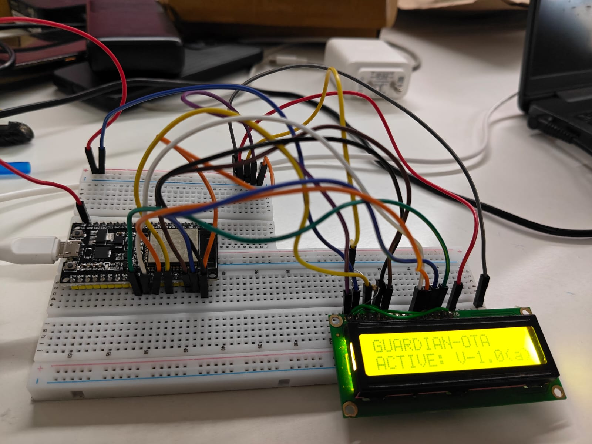
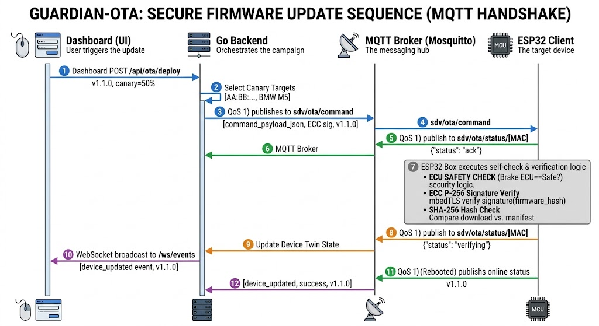
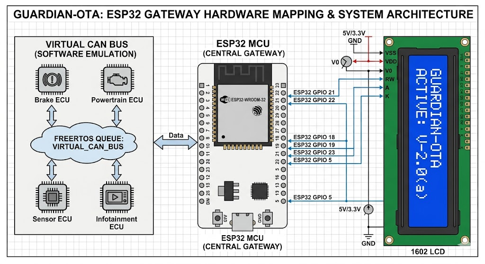

# 🛡️ GUARDIAN-OTA: Secure SDV Over-The-Air Platform

> **Enterprise-Grade OTA Orchestration for the MAHE Mobility Challenge 2026**

GUARDIAN-OTA is a production-hardened **Software-Defined Vehicle (SDV)** firmware orchestration platform. Built for mission-critical reliability, it integrates real-time safety gates, hardware-level cryptographic verification, and a live 3D monitoring engine.

<div align="center">
  
  <p><i><b>Hardware Simulation Demo</b>: ESP32-WROOM acting as the SDV Gateway with HD44780 telemetry output.</i></p>
</div>

[]()
[]()
[]()
[]()

---

## ✨ System Highlights

- **Multi-Layer Trust**: ECC P-256 signature verification and SHA-256 integrity anchoring on **Ethereum Sepolia**.
- **Edge Safety Gates**: Dynamic update rejection based on real-time vehicle state (e.g., Brake ECU health).
- **Glassmorphic Control Center**: Next.js 14 dashboard with real-time WebSocket telemetry and 3D fleet visualization.
- **Remote Rollback**: Instant hardware-level partition flipping for emergency recovery.
- **Embedded CLI**: Seamless terminal integration for direct fleet diagnostics and control.

---

## 🏛️ Architecture & Flow

The platform utilizes a state-of-the-art **Hardware Twin** pattern, synchronizing physical ECU states with cloud-based digital reflections via MQTT.

### 🔄 OTA Orchestration Sequence
<div align="center">
  
  <p><i>The end-to-end lifecycle from binary signature to edge-node partition validation.</i></p>
</div>

---

## 🛠️ Tech Stack & Hardware Mapping

### The Vertical Stack
- **Frontend**: Next.js 14, Three.js (3D HUD), Framer Motion, TailwindCSS.
- **Backend**: Go (Gin), Supabase PostgreSQL, WebSocket Hub.
- **IoT & Infrastructure**: Mosquitto (MQTT), Ethereum Sepolia (Integrity Layer).
- **Firmware**: C / ESP-IDF, FreeRTOS, mbedTLS (Hardware Crypto).

### Hardware Design
<div align="center">
  
  <p><i>Technical mapping for the SDV Gateway simulation.</i></p>
</div>

---

## 🚀 Deployment

### One-Click Startup
```bash
# Optimized launcher for dev environments
node run.js
```
- **Dashboard**: `http://localhost:3000`
- **Backend API**: `http://localhost:8080`
- **Firmware Path**: `/firmware/main/`

---

## 🔐 Security Model

1. **Safety Interlock**: Rejects updates if vehicle movement or mission-critical faults are detected.
2. **Identity Verification**: Every node performs hardware-accelerated ECC P-256 validation of the manifest.
3. **Partition Integrity**: Dual-slot OTA scheme ensures a fallback partition is always available to prevent bricking.
4. **Blockchain Integrity**: Every deployment is immutably anchored on-chain for forensic auditing.

---

<div align="center">

**Made with ❤️ for MAHE Mobility Challenge 2026**

[⬆ Back to Top](#-guardian-ota-secure-sdv-over-the-air-platform)

</div>
